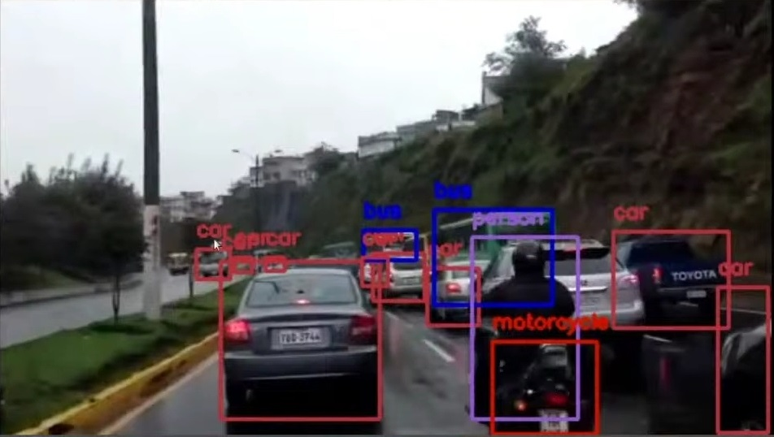

# Computer Vision
 
Deep learning in computer vision was made possible through the abundance of image data in the modern world plus a reduction in the cost of the computing power needed to process it. Large scale image sets like ImageNet, CityScapes, and CIFAR10 brought together millions of images with accurately labeled features for deep learning algorithms to feast upon.
  The agenda for this field is to enable machines to view the world as humans do, perceive it in a similar manner and even use the knowledge for a multitude of tasks such as Image & Video recognition, Image Analysis & Classification, Media Recreation, Recommendation Systems, Natural Language Processing, etc. The advancements in Computer Vision with Deep Learning has been constructed and perfected with time, primarily over one particular algorithm — a Convolutional Neural Network. 
Most of the impressive victories in Image Recognition and identification have been won on the foundations of CNNs 

## Key projects:
<ul>
<li> Image Classification</li>
<li>Face Detection</li>
<li>Numbers Recognition</li>
<li>Face Recognition</li>
 </ul>

## Courses:
Deeplearning.ai's Course 4 - Convolutional Neural Networks (Deep Learning Specialization)

*Image Credit: Wikipedia
